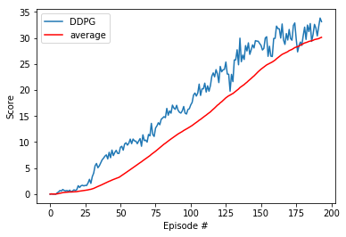

# Report on Continuous Control Project

In this project, I build a reinforcement learning (RL) agent to solve the Unity's Reacher environment using the deep deterministic policy gradient (DDPG) approach (see: https://arxiv.org/pdf/1509.02971.pdf).

In this environment, a double-jointed arm can move to target locations shown as a green sphere moving around. A reward of +0.1 is provided for each step that the agent's hand is in the goal location. The goal of your agent is to maintain its position at the target location for as many time steps as possible. In order to solve the environment, our agent must achieve a score of +30 for 100 consecutive episodes. The final solution used 20 agents.

Some additional details: The observation space consists of 33 variables corresponding to position, rotation, velocity, and angular velocities of the arm. Each action is a vector with four numbers, corresponding to torque applicable to two joints. Every entry in the action vector must be a number between -1 and 1.

## Final Algorithm

This approach was able to solve the problem in 194 episodes.

### Hyperparameters

* Maximum steps per episode: 600
* Replay buffer size: 1e5
* Batch Size: 128
* Gamma (discount factor): 0.99
* Tau (or soft update of target parameters): 1e-3
* Learning Rate (Actor): 1e-3
* Learning Rate (Critic): 1e-3
* Update Frequency (how often to update the network): 10
* Number of learning passes (how many times to sample memory per step): 10
* Ornstein-Uhlenbeck noise parameter: Sigma of 0.2 and Theta of 0.15

### Model Architecture

#### Actor

1. The input to the neural network consists of a 33 x 1 vector corresponding to position, rotation, velocity, and angular velocities of the arm.
2. The first hidden layer is fully-connected and consists of 400 rectifier units.
3.  The second hidden layer is fully-connected and consists of 300 rectifier units.
4. The output layer is fully-connected linear layer with an output of 4.

#### Critic

1. The input to the neural network consists of a 33 x 1 vector corresponding to position, rotation, velocity, and angular velocities of the arm.
2. The first hidden layer is fully-connected and consists of 400 rectifier units.
3. The second hidden layer is fully-connected and consists of 256 rectifier units.
4. The third hidden layer is fully-connected and consists of 128 rectifier units.
5. The output layer is a fully-connected linear layer with a single output for each of the 4 actions.

### Reward Plot

This is the plot of the reward per episode. This was solved in 194 episodes.

## Hyperparameters Tried

I tried many different iterations.

Iteration 1 didn’t learn.

- Less capacity for the model. The actor had 256, 128 nodes, and the critic had 256, 128, 64 nodes.
- Only 1 agent.
- Smaller batch size of 128.
- Updated with every step.
- I used a leaky_relu instead of the relu for the critic.
 
Iteration 2 led me to learn for a while, then plateau, and finally drop.

- Increased the capacity of the model. For critic, increased to 400, 200 nodes and removed the third layer.
- Added gradient clipping
- Set the batch size to 256
- Previosly there was batch norm for the first two layers in the actor and critic. This seemed to be making the computations take a really long time so I removed one of the batch norms.

Iteration 3.

- Increased the capacity for actor and critic. Each had 400, 300 nodes.
- Set a less aggresive updating. Set the update every 20 with 10 loops per update.

Iteration 4.

- Added an epsilong with the noise parameter, this led to the amount of exploration decrease over time.
- Increased the batch size from 1e5 to 1e6.
- Added another layer to the critic with 200 nodes.

Iteration 5.

- Reduce the critic 300->256 and 200->128

## Components of the algorithm

The algorithm uses trial-and-error to figure out the optimal policy (set of actions) that it can take to maximize its rewards.

I used the Deep Deterministic Policy Gradient (DDPG) algorithm. Based on the paper from Deepmind, it is "a model-free, off-policy actor-critic algorithm using deep function approximators that can learn policies in high-dimensional, continuous action spaces." It is an extension of DQNs for continuous tasks with an actor-critic.

The actor estimates the optimal policy by maximizing reward through gradient ascent. The critic estimates the value of different state-action pairs as we might normally with a DQN. Except in this case, the q-values for each action are not used to determine the appropriate action to take via a greedy policy. That would only work with discrete actions. The actions are determined by the actor. The actor makes use of the critic during learning. Given a state, the actor predicts the actions to take and then gets the estimated Q-value with the critic using the state and predicted actions. The actor weights are updated based on maximizing this Q-value.
## Future Improvements

* Try more hyper-parameter tuning
* Add prioritized experience replay. Right now I selected experienced tuples randomly. With prioritized replay, we select experiences based on the magnitude of error (it’s priority). This can improve learning by increasing the probability that an experience is sampled at least once and that rare/important experiences are sampled.
* I can try other approaches like asynchronous methods or TPO.