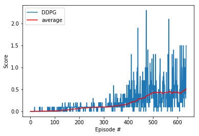

# Report on Collaboration and Competition

In this project, I build a reinforcement learning (RL) agent to solve the Unity's Tennis environment using the Multi Agent Deep Deterministic Policy Gradient (MADDPG) approach (see: https://arxiv.org/abs/1706.02275).

In this environment, there are two agents with their racquets and a moving ball. Each agent can move to different location with the aim of hitting the ball and making it over the net. If an agent hits the ball over the net, it receives a reward of +0.1. If an agent lets a ball hit the ground or hits the ball out of bounds, it receives a reward of -0.01. Thus, the goal of each agent is to keep the ball in play. The environment is considered solved, when the average (over 100 episodes) of those **scores** is at least +0.5.

Some additional details: The observation space consists of 8 variables corresponding to the position and velocity of the ball and racket. Two continuous actions are available, corresponding to movement toward (or away from) the net, and jumping. There are actually 24 variables in the observation space since those 8 variables are given for 3 steps.

## Final Algorithm

This approach was able to solve the problem in 637 episodes.

### Hyperparameters

* Replay buffer size: 1e5
* Batch Size: 128
* Gamma (discount factor): 0.99
* Tau (or soft update of target parameters): 6e-2
* Learning Rate (Actor): 1e-4
* Learning Rate (Critic): 1e-3
* Update Frequency (how often to update the network): 1
* Number of learning passes (how many times to sample memory per step): 1
* Ornstein-Uhlenbeck noise parameter: Sigma of 0.2 and Theta of 0.15

### Model Architecture

#### Actor

This is for each agent.

1. The input to the neural network consists of a 24 x 1 observation vector
2. The first hidden layer is fully-connected and consists of 256 rectifier units.
3. Batch normalization was done after the first layer.
4. The second hidden layer is fully-connected and consists of 128 rectifier units.
5. The output layer is fully-connected linear layer with an output of 2.

#### Critic

The critic was centralized, so there were 2 critics but they received the same input.

1. The input to the neural network consists of a 48 x 1 vector corresponding to information from each agent.
2. The first hidden layer is fully-connected and consists of 256 rectifier units.
3. Batch normalization was done after the first layer.
4. The second hidden layer is fully-connected and consists of 128 rectifier units.
5. The output layer is a fully-connected linear layer with an output of 4.

### Reward Plot

This is the plot of the reward per episode. This was solved in 637 episodes.

## Hyperparameters Tried

I tried several variations but interestingly this first set of hyperparameters performed the best (i.e., the average score of 0.5 across 100 episodes was reached faster). The variations tried include:

* Increased buffer size to 1e6
* Update every 4 steps and do 2 iterations per update
* Increased the batch size to 256
* Set the Tau to be lower 1e-2

## Components of the algorithm

The algorithm uses trial-and-error to figure out the optimal policy (set of actions) that it can take to maximize its rewards for two agents.

I used the MADDPG, which is based on the Deep Deterministic Policy Gradient (DDPG) algorithm. Based on the paper from Deepmind, DDPG is "a model-free, off-policy actor-critic algorithm using deep function approximators that can learn policies in high-dimensional, continuous action spaces." It is an extension of DQNs for continuous tasks with an actor-critic. The MADDPG builds on this with "centralized planning with decentralized execution". Basically, there is an agent and critic for each agent. The critic during training is centralized in the sense that it received observation information for both agents.

First, I'll explain the DDPG components. The actor estimates the optimal policy by maximizing reward through gradient ascent. The critic estimates the value of different state-action pairs as we might normally with a DQN. Except in this case, the q-values for each action are not used to determine the appropriate action to take via a greedy policy. That would only work with discrete actions. The actions are determined by the actor. The actor makes use of the critic during learning. Given a state, the actor predicts the actions to take and then gets the estimated Q-value with the critic using the state and predicted actions. The actor weights are updated based on maximizing this Q-value.

Now, I can explain the unique additions of the MADDPG. It has an actor-network for each agent that uses local observations for deterministic actions, as well as a critic-network for each agent that uses joint states action pairs to estimate Q-values. The idea of the centralized critic (knows observations and actions taken by all agent) is to make the environment stationary even when policies change. There's also a target actor-network with identical functionality for training stability. I noticed that you could use one critic-network for both agents but I didn't try this option. At test, the centralized module can be removed so the agent via the actor-network only relies on local observations and their own policies.

## Future Improvements

* Try other model parameters like different width and number of layers.
* Use prioritized experience replay to enhance experience sampling.
* Try dropout or a different optimizer to stabilize learning.
* Try out other Actor-Critic method variants such as PPO, A3C, or GAE.
* Use some hyperparameter optimization tool to try a larger space of parameters
